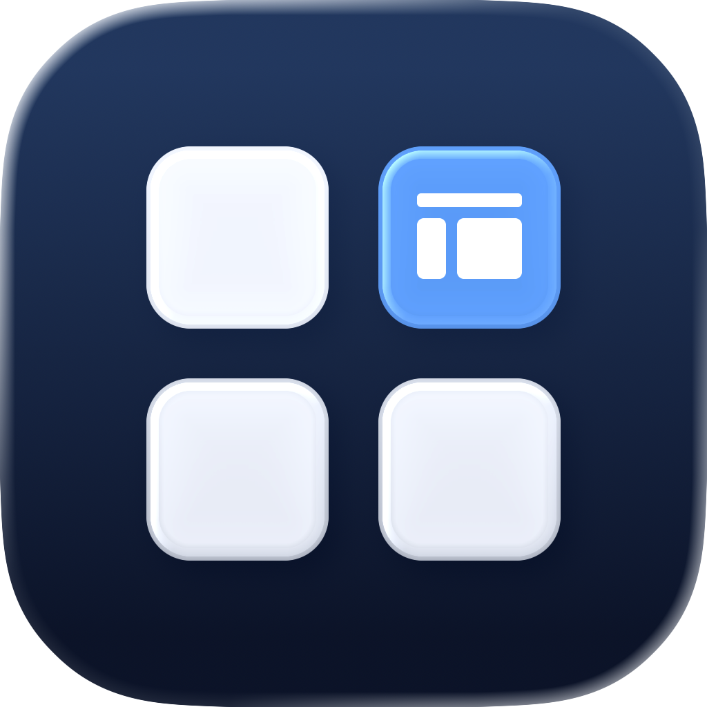

<div align="center">
  
  <h1>Workspace Status</h1>
  <p>Your AeroSpace workspaces, applications, and unread indicators — at a glance.</p>
  <p>
    <a href="https://github.com/Li-RC/workspace-status/releases/latest">Download</a> ·
    <a href="#getting-started">Getting started</a> ·
    <a href="#build-from-source">Build from source</a> ·
    <a href="LICENSE">MIT license</a>
  </p>
</div>

Workspace Status is a native macOS menu bar app for [AeroSpace](https://nikitabobko.github.io/AeroSpace/). See which apps are open across your workspaces, switch between them, and focus a window from a compact dropdown.

## Features

- **Workspace overview.** Occupied workspaces appear in natural numeric order, with an icon for every distinct open application. A filled number badge identifies your current workspace.
- **Direct navigation.** Switch workspaces from the menu bar, or use the dropdown to select an app or a specific window.
- **Focused dropdown.** Empty workspaces stay out of the overview. Expand a workspace to see its windows; the sections below move down automatically.
- **Native Liquid Glass.** On macOS 26 and later, separate workspace and notification sections follow the system's glass appearance. The surrounding background is transparent.
- **Unread indicators.** An orange bell highlights apps with Dock badges. View those apps and their badge values under **Notifications**.
- **Local operation.** No third-party packages or network services. Workspace updates follow AeroSpace events, and the app leaves your window manager configuration untouched.

> This README describes the current development source. Published releases may have an earlier feature set.

## Requirements

| Requirement | Details |
| --- | --- |
| macOS | 14 or later; native Liquid Glass requires macOS 26 or later |
| Window manager | AeroSpace must be installed and running |
| Architecture | Published binaries target Apple Silicon; source builds use the host architecture |
| Accessibility | Optional; required only to read Dock badges |

## Getting started

1. Download a DMG or ZIP from [GitHub Releases](https://github.com/Li-RC/workspace-status/releases/latest).
2. For a DMG, drag **Workspace Status.app** into **Applications**. For a ZIP, extract it and move the app into **Applications**.
3. Start AeroSpace, then open **Workspace Status**.

The app runs in the menu bar without a Dock icon. To start it at login, add it in **System Settings → General → Login Items**.

Local builds are ad-hoc signed and are not notarized.

## Using Workspace Status

| Control | Action |
| --- | --- |
| Workspace number or app icons in the menu bar | Switch to that workspace |
| Bell | Toggle the dropdown open or closed |
| Workspace number in the dropdown | Switch to that workspace |
| App icon in the dropdown | Focus a window of that app in that workspace |
| Window count / chevron | Expand or collapse the workspace's window list |
| Window in an expanded list | Focus that window |
| App under Notifications | Focus one of its windows, or open the app |
| Refresh | Reload workspace information |
| Quit | Exit Workspace Status |

Menu bar app icons belong to their workspace button. Individual app selection is available inside the dropdown. The current workspace keeps its menu bar indicator even when empty.

Click outside the dropdown or press **Escape** to close it. The dropdown grows downward without scrolling; if its contents exceed the display height, it scales to fit. Opening animations respect **Reduce Motion**.

## Notifications and privacy

The **Notifications** section displays unread indicators from app badges in the Dock. To enable it:

1. Open the dropdown and click **Enable Accessibility…**.
2. Enable **Workspace Status** in **System Settings → Privacy & Security → Accessibility**.
3. Leave the app running; it checks permission changes automatically.

Workspace navigation works without this permission. Dock badges refresh every five seconds and show app names, icons, and badge values. Notification Center, notification banners, history, and message content are not read. Badge information is neither persisted nor sent to a server.

Keep the app in a stable location before granting Accessibility access. Moving or rebuilding it may require granting permission again.

## Limitations

- Workspace navigation supports **AeroSpace workspaces**. macOS Mission Control desktops are not supported.
- Dock badges represent app unread counts or status; they do not confirm a new notification. Apps without an exposed Dock badge will not appear under Notifications.
- macOS may hide indicators when the menu bar is crowded. Occupied workspaces and their applications remain available in the dropdown.

## Build from source

Install **Xcode with the macOS 26 SDK or newer** and select it as the active developer directory. The build uses Xcode's asset compiler for the Icon Composer document, alongside the Swift compiler. Then run:

```sh
git clone https://github.com/Li-RC/workspace-status.git
cd workspace-status
bash build.sh
open "dist/Workspace Status.app"
```

The build script compiles the app for your Mac's architecture, generates its native app icon from the editable Icon Composer project, signs it locally, and runs its self-tests. The app bundle is written to `dist/Workspace Status.app`.

<details>
<summary><strong>Developer checks and previews</strong></summary>

Run checks from the repository root:

```sh
app_binary="dist/Workspace Status.app/Contents/MacOS/WorkspaceStatus"
"$app_binary" --diagnose
"$app_binary" --menu-test
"$app_binary" --layout-test
"$app_binary" --bell-click-test
"$app_binary" --popover-test
```

| Check | Coverage |
| --- | --- |
| `--self-test` | JSON decoding, workspace ordering and filtering, app deduplication, and display size limits; also runs during the build |
| `--diagnose` | Live workspace and application data plus Accessibility state, excluding window titles |
| `--smoke-test` | Eight-second run checking live workspace loading and menu bar image creation; quit any existing instance first |
| `--menu-test` | Native menu bar ordering, complete app icons, compact spacing, and current-workspace clicks |
| `--layout-test` | Expansion, added workspaces, collapse, a fixed top edge, and a tall list fitting without scrolling |
| `--bell-click-test` | Four native bell clicks verifying open → closed → open → closed |
| `--popover-test` | Popup containment, transparent background, completed fade, and dismissal behavior |

The checks do not switch your workspaces or generate notifications. Menu and layout tests use synthetic data. Inactive-workspace switching and individual app focus still require manual validation.

To capture the native dropdown over the desktop:

```sh
"$app_binary" --popover-test --render-popup-preview /tmp/workspace-status.png
```

This requires screen capture access and exports both the window image and a `-composited.png` preview. Other preview options are `--render-menu-preview <file>` with `--menu-test`, `--render-layout-preview <prefix>` with `--layout-test`, and `--render-preview <file>` for an offscreen layout. Offscreen previews do not reproduce native glass composition.

</details>

## Project structure

| Path | Purpose |
| --- | --- |
| `Sources/AeroSpace.swift` | AeroSpace integration and workspace state |
| `Sources/Notifications.swift` | Dock badge monitoring through Accessibility |
| `Sources/App.swift` | Menu bar controls and the SwiftUI dropdown |
| `Sources/main.swift` | App entry point and verification commands |
| `build.sh` | Local compilation and signing |
| [`Design/AppIcon/`](Design/AppIcon/) | Editable Icon Composer project, SVG layers, and appearance previews |

## Contributing

Bug reports and pull requests are welcome. For a bug report, include your macOS version, AeroSpace version, and steps to reproduce the issue. For code changes, run the relevant checks above and verify affected interactions in the app.

## License

Workspace Status is open source under the [MIT license](LICENSE), including its original icon artwork.
